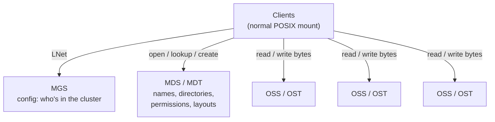

I've been on a bit of a quest lately: trying to understand how data actually works and moves, from first principles. Not "which database should I use," but what is physically happening when a byte gets written, where it lives, who is allowed to touch it, and what happens when the machine holding it dies halfway through.

At the end of my [last post](https://njange.github.io/posts/The-Three-Questions-I-Now-Ask-Before-Shipping-Anything/) I said storage engines were next. I didn't expect the detour to go through a supercomputer.

A few days ago I came across a post by **Angel of Verdant**: a video called [*Lustre File System for Dummies*](https://www.youtube.com/watch?v=ND0s-gfNnd8). I had heard the name Lustre before, vaguely, as "the thing HPC people use." I had never once wondered how it works.

The title promised dummies. I qualified.

Strip away the word "filesystem" and Lustre is, in almost every way that matters, a **distributed database**. It has primary keys, indexes, a write-ahead log, a lock manager, crash replay and sharding. All the things I've been writing about on this blog, just wearing different clothes.

<!--more-->

## The problem: one server is one bottleneck

Start with the simplest possible network filesystem. One server, one big disk, lots of clients. NFS, roughly.

That server has two jobs:

1. Answer *"where is this file and am I allowed to open it?"*
2. Ship the actual bytes.

With ten laptops, that's fine. With ten thousand compute nodes all trying to read the same 50 TB simulation output at once, that one server becomes the narrowest pipe in the building. It doesn't matter how fast your compute nodes are. They all queue behind the same network card.

Lustre's whole design comes from one decision:

> Separate *knowing where the data is* from *moving the data*, and spread the data across as many machines as you can.

Clients ask one service where things live. Then they go and fetch the bytes directly from many storage servers in parallel, without asking anyone's permission again.

If you've read Chapter 6 of *Designing Data-Intensive Applications*, you'll recognise this. It's partitioning. Except the thing being partitioned isn't rows, it's the inside of a single file.

## The cast of characters



- **MGS (Management Server).** Holds the configuration. When anything joins, it asks the MGS what the filesystem looks like.
- **MDS / MDT (Metadata Server / Target).** The server and its disk that store the *namespace*: filenames, directories, owners, permissions, timestamps and, crucially, each file's **layout**.
- **OSS / OST (Object Storage Server / Target).** The servers and disks that hold the actual file contents, stored as **objects**. A big system has hundreds or thousands of these.
- **Clients.** A Linux kernel module. Your application calls `open()` and `write()` like it would on a laptop and has no idea any of this is happening.
- **LNet.** Lustre's own networking layer, so the same code runs over TCP or InfiniBand with RDMA, and can route between different networks.

The MDT is the brain. The OSTs are the muscle. And once a client knows what it needs, **the brain is not involved in moving bytes at all.**

## Striping: one file, many disks

When you create a file, the MDS gives it a layout. Something like:

> stripe count 4, stripe size 1 MiB, on OSTs 7, 12, 3 and 20.

That's RAID-0, but across *servers* instead of across disks in one box:

```text
file offset:  [0-1M] [1-2M] [2-3M] [3-4M] [4-5M] [5-6M] ...
lives on:      OST7   OST12  OST3   OST20  OST7   OST12  ...
```

The client gets that layout once, at `open()`, and from then on it does the arithmetic itself:

```text
stripe_index  = (offset / stripe_size) % stripe_count
object_offset = (offset / (stripe_size * stripe_count)) * stripe_size
              + (offset % stripe_size)
```

Want byte 5.5 MiB? That's stripe number 5, which is index `5 % 4 = 1`, so OST12, at offset 1.5 MiB inside its object. No round trip to the MDS. No central coordinator. Four OSTs means roughly four times the bandwidth, and a thousand means roughly a thousand.

That is the entire scaling story in one formula. It's the same trick as hash-partitioning a table: if every client can compute where a piece of data lives, nobody has to ask.

It has a cost, though, and it's the one every partitioned system pays. Small things suffer. A 4 KB file still needs a trip to the MDS *and* a trip to an OST. Millions of tiny files are Lustre's well-known weak spot, which is why newer versions added features like:

- **Progressive File Layouts (PFL).** The first megabyte of a file might live on one OST while everything past a gigabyte is spread across thirty-two. The layout grows with the file.
- **Data-on-MDT (DoM).** Small files skip the OSTs entirely and live on the metadata server.

## Where it starts looking like a database

This is the part I didn't expect. Once I started reading about the internals, I kept seeing ideas I already knew from Postgres.

### FIDs are primary keys

Every file and object in Lustre gets a **FID (File IDentifier)**: 128 bits made of a sequence number, an object id and a version. It's assigned once and never reused.

Paths change. You rename things, move them between directories. FIDs don't. A path is a human-friendly label. The FID is the identity.

That's exactly the distinction between a natural key and a surrogate primary key. And just like a database, Lustre needs a way to find a row from its key:

- The **FLD (FID Location Database)** maps a FID's sequence to the server that owns it. That's a shard map.
- The **OI (Object Index)** on each server maps a FID to the local inode on disk. That's a secondary index. If it gets corrupted, Lustre can rebuild it by scanning, which is essentially a `REINDEX`.

You can even query it from the command line with `lfs path2fid` and `lfs fid2path`.

### There's a storage engine underneath

Lustre doesn't write raw blocks to a disk. Each server sits on top of a local filesystem, through an abstraction called the **OSD (Object Storage Device)** layer. Today that's one of two backends:

- **ldiskfs**, a patched ext4, with its journal (jbd2), hashed B-tree directories and extents.
- **ZFS**, with copy-on-write and transaction groups.

If you've ever seen MySQL swap InnoDB for another engine, it's the same idea. Lustre is the query layer; the OSD is the pluggable storage engine.

And here's a detail I love. On the metadata server, a file is an inode **with no data in it at all.** All the interesting information hangs off extended attributes: one holds the file's own FID, one holds the striping layout (which OST objects make up the file), and one holds back-pointers to its parent directories. The MDT is a giant index of *where things are*, built out of a filesystem.

## Crash recovery: the redo log lives on the clients

This is the single most interesting thing I learned, and it's the part that connects most directly to my earlier posts on transactions.

Every change on a Lustre server, whether it's a create, an unlink or a write, runs inside a local transaction on the backend (a jbd2 journal handle, or a ZFS transaction group). The server stamps it with a monotonically increasing **transaction number**, a *transno*. If you've read about write-ahead logs, this is basically an LSN.

When the server replies, it tells the client two things:

1. Your request got transno `N`.
2. Everything up to transno `last_committed` is safely on disk.

And then the clever bit:

> The client keeps a copy of every request it sent until `last_committed` moves past it.

So the server is allowed to say "done" before the data has actually hit the disk, which is fast. If it crashes before committing, nothing is lost, because every client is still holding its own uncommitted requests. When the server comes back, it opens a **recovery window**, the clients **replay** their requests in transno order, and the server rebuilds the exact state it had before it fell over.

```text
Client                          Server
  │  create foo ───────────────►  │ transno 101 (in memory)
  │  ◄──── ok, 101, committed=98  │
  │  [keeps 101 in replay list]   │
  │                               ✗  crash before commit
  │                               │  restart, recovery window
  │  replay 101 ───────────────►  │ re-executes 101
  │  ◄──── ok, committed=101      │
  │  [drops 101]                  │
```

In a database, the redo log sits next to the data. In Lustre, the redo log is effectively **spread across the memory of every client in the cluster.** I sat with that for a while.

Of course, it's not that simple in practice. What if one client never comes back to replay? There's **version-based recovery**, which checks per-object versions so the others can still replay safely. What if my uncommitted change depends on *your* uncommitted change? There's **commit-on-share**, which forces a commit at exactly the moment that dependency would form. Same problems databases face, same shape of answers.

## The lock manager: my last two posts, at cluster scale

In [*On locks, deadlocks and isolation levels*](https://njange.github.io/posts/Locking-And-Deadlocks/) I wrote about rows waiting their turn behind `SELECT FOR UPDATE`. Lustre has the same problem, except the "rows" are cached chunks of files spread across thousands of machines.

If client A has part of a file cached in memory and client B writes to that same part, A's cache is now lying. Something has to tell A.

That something is the **LDLM (Lustre Distributed Lock Manager)**, descended from the lock manager in VAX/VMS. The rule is simple:

> A client may only cache data while it holds a lock that covers it.

The lock modes will look familiar to anyone who's read a database textbook: `EX` (exclusive), `PW` (protected write), `PR` (protected read), `CW`, `CR` and `NL`, with the same kind of compatibility matrix that decides who can share and who has to wait.

A few things make it more interesting than a row lock:

- **Extent locks.** On the OSTs, you lock a *byte range* of an object, not the whole thing. Two clients writing to different parts of the same file can both proceed. It's the same idea as range locks in a database.
- **Inodebits locks.** On the metadata server, you lock *pieces* of a file's metadata separately: the lookup, the permissions, the layout, the extended attributes. Running `chmod` doesn't throw away everyone's cached directory lookups. It's like having column-level locks.
- **Callbacks instead of waiting.** When B wants a lock that A holds, the server doesn't just make B queue. It sends A a **blocking callback**: *please flush your dirty pages, drop your cache and give the lock back.* A cooperates, and B proceeds.
- **Eviction.** If A doesn't respond, maybe because it's hung or the network died, the server eventually **evicts** it and takes the lock back by force. It reminded me of a database picking a deadlock victim. Someone has to lose so the system can keep moving.

And the failure mode I wrote about last time, **contention**, shows up here too. If two clients keep writing into the *same stripe*, they ping-pong the extent lock back and forth and throughput collapses. Nothing is broken and nothing deadlocks, but it gets slow. The fix is the same instinct as before: keep each writer to its own region, ideally aligned to stripe boundaries, so nobody has to share.

## Even the file size is distributed

Here's a small consequence that made the whole design click for me.

Because a file's bytes are spread across several OSTs, **the metadata server doesn't actually know how big the file is.** The last byte could be on any of them.

So when you `stat()` a file, Lustre has to ask every OST holding a stripe "how far does your piece go?" and take the maximum. That's why `ls` in a huge directory is fast but `ls -l` can crawl. The second one needs the size of every file, and every size is a little distributed query.

Newer versions keep a **lazy size** on the MDT, an approximate cached value for tools that can live with slightly stale answers. That's a materialised view, give or take.

## Sharding the metadata, and distributed transactions

Eventually one metadata server isn't enough either, so Lustre added **DNE (Distributed Namespace)**: multiple MDTs, with directories placed on different servers, and in later versions a *single directory* striped across several MDTs by hashing the filename.

That's hash partitioning again. And it brings in the hardest problem in the book. If I rename a file from a directory on MDT0 to a directory on MDT1, that's one logical operation touching two machines. Either both sides happen, or neither does.

Lustre handles it with **update logs** written on each participant, so that after a crash it can redo or undo the half-finished operation. It's not literally two-phase commit, but it's solving the same problem with the same ingredients: write down your intentions durably before you act on them.

## What I'm taking away from this

I went into that video expecting to learn about a niche HPC tool. I came out with a much clearer picture of something more general.

Every system that stores data at scale ends up answering the same handful of questions:

- **How do I find it?** Lustre uses FIDs, the FLD and the Object Index. A database uses primary keys and indexes.
- **How do I spread it out?** Lustre uses striping and DNE. A database uses partitioning.
- **How do I survive a crash?** Lustre uses journals, transnos and client replay. A database uses a write-ahead log.
- **How do I stop concurrent writers from corrupting it?** Lustre uses the LDLM. A database uses row locks and isolation levels.
- **How do I change two machines at once?** Lustre uses update logs. A database uses distributed transactions.

A filesystem and a database are not two different species. They're two answers to the same questions, tuned for different workloads. Lustre is tuned for a few giant files read by thousands of machines at once. Postgres is tuned for millions of tiny rows touched by thousands of transactions at once.

Before, I'd have described Lustre as "a fast filesystem." Now I'd describe it as a database whose rows happen to be byte ranges.

The question I keep coming back to, the one this whole quest is really about, is:

> When a byte moves, who knows where it went, and who is allowed to believe them?

Every system I've looked at so far has a different answer. That's the part I find most interesting.

Thanks to Angel of Verdant for the video that sent me down this rabbit hole.

---

## Further Reading

- [*Lustre File System for Dummies*](https://www.youtube.com/watch?v=ND0s-gfNnd8) — Angel of Verdant (YouTube)
- [Lustre Getting Started](https://wiki.lustre.org/Lustre_Getting_Started) — Lustre Wiki
- [Lustre 101: Inside the Lustre File System](https://www.linux.com/news/lustre-101-inside-lustre-file-system/) — Linux.com
- [Parallel I/O: Lustre](https://cvw.cac.cornell.edu/parallel-io/lustre) — Cornell Virtual Workshop
- [lustre.org](https://lustre.org/) — the Lustre project home
- [Lustre Operations Manual](https://doc.lustre.org/lustre_manual.xhtml) — the reference for everything above, from striping to recovery
- *Designing Data-Intensive Applications* — Martin Kleppmann (Chapter 3 on storage engines, Chapter 6 on partitioning, Chapter 7 on transactions)
